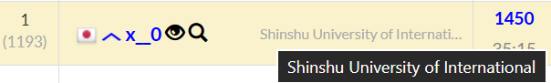
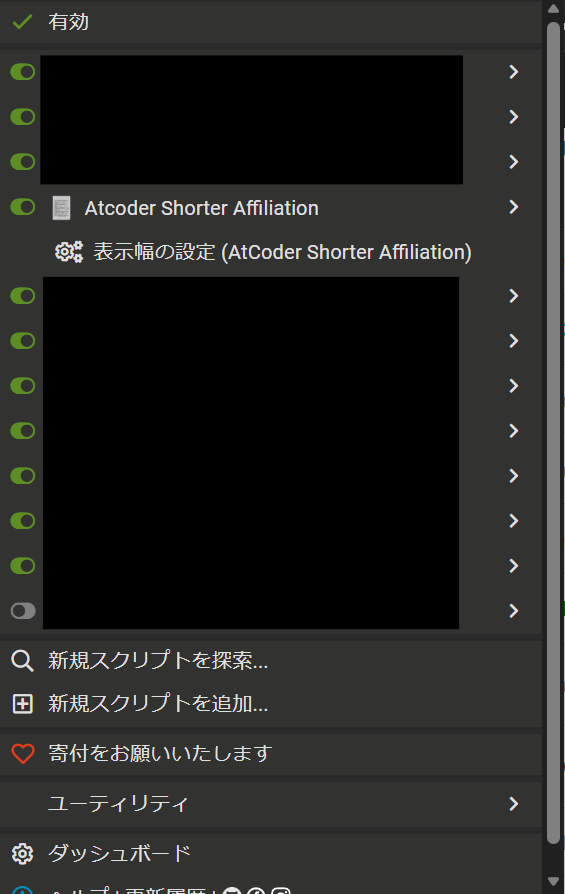

<div align="center">

# AtCoder Shorter Affiliation



AtCoderの順位表の「所属」列をスリムに。

[](https://opensource.org/licenses/MIT)
[](https://bun.sh/)

[](https://greasyfork.org/ja/scripts/575455-atcoder-shorter-affiliation)


</div>

---

## 概要

AtCoderの順位表において、所属名が長すぎてレイアウトが崩れたり見づらくなったりするのを防ぐためのユーザースクリプトです。
ac-predictor+所属欄表示で発生する表示崩れへの対策として開発しました。

指定した幅（半角文字基準）を超える所属名を自動的に `…` で省略し、マウスホバー時にフルネームを表示します。

## 特徴

- **スマートな省略**: `string-width` を使用し、全角/半角を考慮した正確な幅で省略判定を行います。
- **動的更新に対応**: 順位表の読み込みや検索、ページの切り替え時も `MutationObserver` によって自動的に適用されます。
- **カスタマイズ可能**: ブラウザの拡張機能メニュー（Tampermonkey 等）から、省略の基準となる幅（デフォルト: 32）をいつでも変更できます。

## インストール

1. **Tampermonkey** などのユーザースクリプト管理マネージャーをブラウザにインストールします。
2. [Greasy Fork](https://greasyfork.org/ja/scripts/575455-atcoder-shorter-affiliation) からインストールしてください。

## 設定方法

1. AtCoderの順位表ページ（`/contests/*/standings`）を開きます。
2. ユーザースクリプトマネージャーのメニュー（Tampermonkeyのアイコンをクリック）から **「表示幅の設定 (AtCoder Shorter Affiliation)」** を選択します。



3. 表示したい最大幅（半角基準）を入力して保存してください。

## 開発者向け

このプロジェクトは [vite-plugin-monkey](https://github.com/lisonge/vite-plugin-monkey) を使用して構築されています。
また、bunはmiseを使って導入してください。

### コマンド

```bash
# 依存関係のインストール
bun install

# 開発モード (スクリプトの自動更新が有効になります)
bun dev

# ビルド (dist/ にユーザースクリプトを出力)
bun run build
```

## 帰属表記

- string-width: MIT License <https://github.com/sindresorhus/string-width/blob/main/license>

## ライセンス

[MIT](LICENSE)
